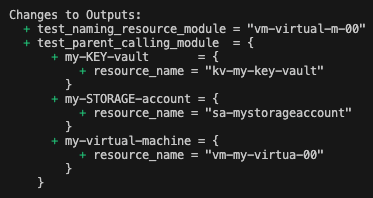

# tf-prompt

# Senior Cloud DevOps Engineer (flex-hybrid) Terraform Prompt

## Test Naming Resource Module and Parent Calling Module 

To test both modules, change directory into "test_module". Then run the following commands:
1. `terraform init`
2. `terraform plan`
3. You will then see the string manipulation logic applied for each resource type and it's generated name as noted below:

